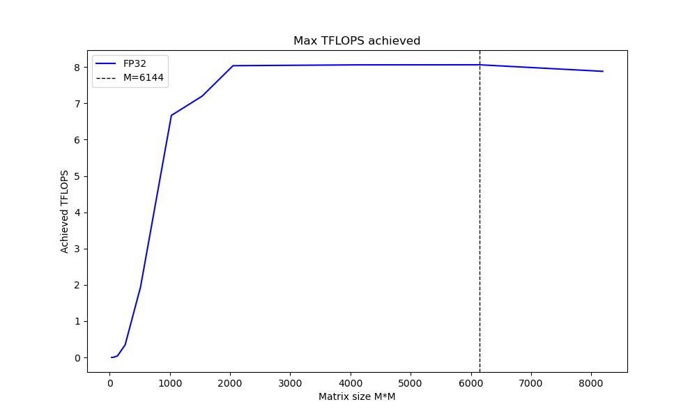

# tf-metal-experiments

TensorFlow Metal Backend on Apple Silicon Experiments (just for fun)

## Setup

This is tested on M1 series Apple Silicon SOC only. 

### TensorFlow 2.x

1. Follow the official instructions from Apple [here](https://developer.apple.com/metal/tensorflow-plugin/)
2. Test that your Metal GPU is working by running `tf.config.list_physical_devices("GPU")`, you should see 1 GPU present (it is not named). Later when you actually use the GPU, there will be a more informative printout that says `Metal device set to: Apple M1 Max` or similar.
3. Now you should be ready to run any TF code that doesn't require external libraries.

### HuggingFace Transformers library

If you want to play around with Transformer models (with TF Metal backend of course), you will need to install the HuggingFace Transformers library.

1. Install the `regex` library (I don't know why it has to be like this, but yeah): `python3 -m pip install --upgrade regex --no-use-pep517`. You might need do `xcode-select --install` if the above command doesn't work.
2. `pip install transformers ipywidgets`

## Experiments and Benchmarks

After some trial and error, some initial benchmarks for what should be the approx best capability of the M1 Max.

* For all the cases here, increasing batch size does not seem to increase the throughput.
* High Power Mode enabled + plugged into charger (this does not seem to affect the benchmarks anyway)

Power draw also doesn't seem to be able to go much higher than ~40W:

* Power draw from the GPU (averaged over 1 second) can be measured with `sudo powermetrics --samplers gpu_power -i1000 -n1`.
* I decided to report peak power as observed via `asitop` (see: [tlkh/asitop](https://github.com/tlkh/asitop))


| Model       | GPU        | BatchSize | Throughput  | Peak Power | Memory |
| ----------- | ---------- | --------- | ----------- | ----- | ------ |
| ResNet50    | M1 Max 32c | 128       | 140 img/sec | 42W   | 21 GB  |
| MobileNetV2 | M1 Max 32c | 128       | 352 img/sec | 37W   | 13 GB  |
| DistilBERT  | M1 Max 32c | 64        | 120 seq/sec | 35W   | 9 GB   |
| BERTLarge   | M1 Max 32c | 16        | 19 seq/sec  | 36W   | 14 GB  |

The benchmark scripts used are included in this repo.

```shell
python3 bm_rn50.py
python3 bm_mnv2.py
python3 bm_distilbert.py
python3 bm_bertlarge.py
```

**Reference Benchmarks from RTX 3090**

| Model       | GPU        | BatchSize | Throughput  | Power |
| ----------- | ---------- | --------- | ----------- | ----- |
| Same Batch Size as M1 | | | | |
| ResNet50    | 3090       | 128       | 1100 img/sec| 360W  |
| MobileNetV2 | 3090       | 128       | 2001 img/sec| 340W  |
| DistilBERT  | 3090       | 64        | 1065 seq/sec| 360W  |
| BERTLarge   | 3090       | 16        | 131 seq/sec | 335W  |
| Larger Batch Size | | | | |
| ResNet50    | 3090       | 256       | 1185 img/sec| 370W  |
| MobileNetV2 | 3090       | 256       | 2197 img/sec| 350W  |
| DistilBERT  | 3090       | 256       | 1340 seq/sec| 380W  |
| BERTLarge   | 3090       | 64        | 193 seq/sec | 365W  |

For 3090, same script is used, but additional optimization that leverage hardware (Tensor Core) and software (XLA compiler) not present/working on M1 is added. Also increase the length of an epoch, as sometimes 3090 is too fast and results in poorer measurement due to overhead of starting/ending the training which finishes in seconds.

Note: 3090 running at 400W power limit. CPU is 5600X.

```shell
# config for NVIDIA Tensor Core GPU
# run with more steps, XLA and FP16 (enable tensor core aka mixed precision)
python3 bm_rn50.py --xla --fp16 --steps 100
python3 bm_mnv2.py --xla --fp16 --steps 100
python3 bm_distilbert.py --xla --fp16 --steps 100
python3 bm_bertlarge.py --xla --fp16 --steps 30

# If no Tensor Core, remove --fp16 flag
```

## Measuring Achievable TFLOPS

We can use TF to write a matrix multiplication benchmark to try and estimate what is the max compute performance we can get out of a M1 Max. It seems we can get around ~8 TFLOPS for large enough problem (GEMM) sizes.



The plot can be generated using `tflops_sweep.py`. 

Note that FP64 and FP16 performance appears to be non-existent. (the code automatically runs on CPU if FP64 or FP16 is specified as data type)
